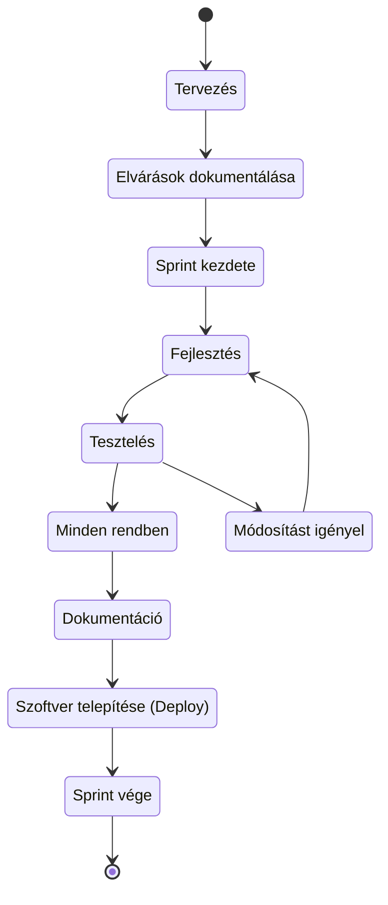

# Fejlesztési körforgás

## Fejlesztési Folyamat (CI/CD)

### 1. Tervezés
- **Cél:** Elvégzendő felhasználói történetek összegyűjtése, rendszerezése
- **Tevékenységek:**
    - Követelmények begyűjtése a felhasználói történetekből
    - Követelmények elkészítésének felosztása a csapattagok között
    - Ütemterv megtervezése a két hetes sprintben
- **Kimenet:** Sprint backlog, tartalmazza az elvégzendő feladatokat és azok felosztását.

### 2. Fejlesztés
- **Cél:** Megoldások implementálása
- **Tevékenységek**:
    - Kódolás és verziókezelés a sprint számára létrehozott branchen
    - Funkciók megvalósítása
    - Kódellenőrzés Pull-request formájában
- **Kimenet:** Tesztelésre kész funkcionalitások

### 3. Tesztelés
- **Cél:** Működés ellenőrzés és kiadás előkészítése
- **Tevékenységek**:
    - Egységtesztek, integrációs tesztek,és rendszer tesztek írása és futtatása
    - Funkcionalitás ellenőrzése a követelményekhez képest
    - Teljesítmény és biztonság manuális és autómatizált tesztelése
    - Hibák azonosítása, dokumentálása és javítása
- **Kimenet:** Tesztelési eredmények, hibajelentések és a javításokhoz kapcsolódó kód módosítások.

### 4. Dokumentáció
- **Cél:** Funkcionalitáshoz tartozó dokumentációk elkészítése
- **Tevékenységek**:
    - Végfelhasználói dokumentáció kiegészítése
    - Fejlesztési dokumentáció kiegészítése
    - Projekt helyzetjelentés
- **Kimenet:** Sprint teljes dokumentációja

### 5. Szoftver telepítés (Deploy)
- **Cél:** Szoftver telepítése CI/CD pipelineon keresztül az AWS szolgáltatásokra
- **Tevékenységek**:
    - AWS Amplify pipeline telepítés
    - AWS Lambda pipeline telepítés
    - Végső verzió ellenőrzése
- **Kimenet:** Teljesen működő szoftver

